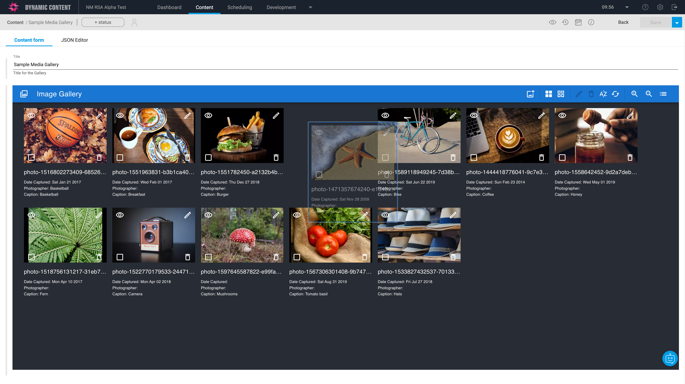
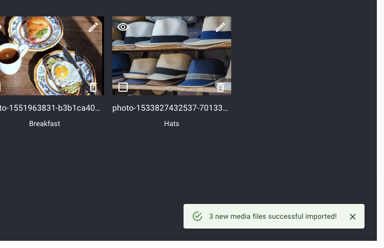
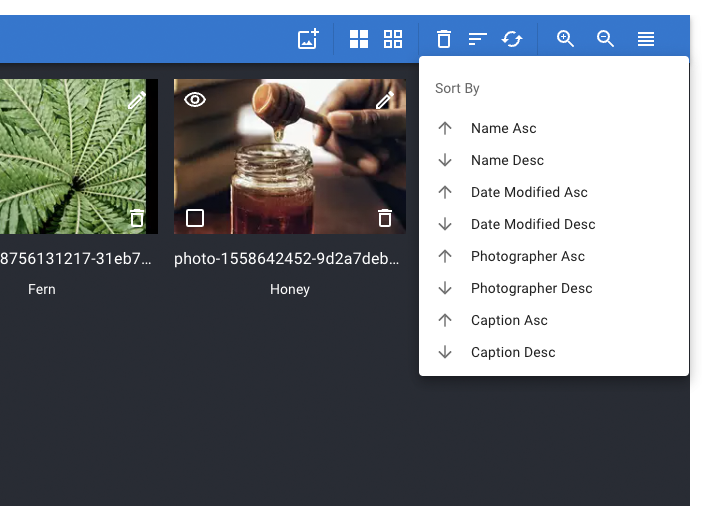
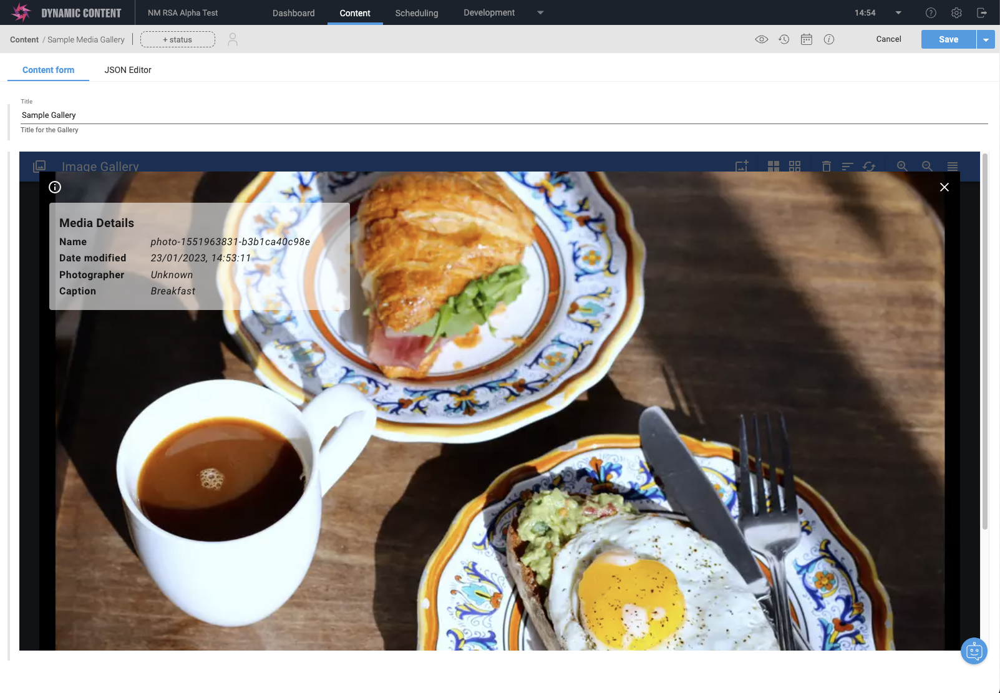

[](https://amplience.com/dynamic-content)



# Dynamic Content Media Gallery Extension
This extension allows you to manage a collection of media items easily, with import from Content Hub, drag-and-drop, sorting, grid and list view.

## Features

### Grid View


### List View


### Toolbar


You can perform the following actions from the toolbar:
- import new media items
- select all media item
- de-select all media item
- remove selected media items
- sort collection (by date mofified, author, caption)
- reset collection
- switch betwen grid and list view

### Context Menu


Context menu with all possible action can be opened when right clicking on a specific media item, on the top left icon, or anywhere else on the interface, as well as using the `m` keyboard shortcut.

### Notifications



For some actions, notifications can appear on the top left corner of the interface:
- removing multiple media items
- importing new media items
- resetting the collection

### Keyboard Shortcuts

For accessibility, the extension can also be used using the following shortcuts, as appearing on the context menu:


- `v` - view currently focused item
- `e` - edit currently focused item
- `r` - remove currently focused item
- `i` - open the import drawer
- `a` - select all items
- `n` - deselect all items
- `R` - remove selected items
- `s` - sort items
- `Z` - reset collection
- `l` - list view
- `g` - grid view
- `m` - open context menu

### Manual re-ordering


The interface offers drag-and-drop to manually re-order media items in the collection.


For accessibility, the interface also offers to use the keyboard to re-order items. You can follow these steps:
- focus an item using the `tab` key
- move focus using arrow keys
- trigger drag-and-drop using the `return` key
- move the item using the arrow keys
- end drag-and-drop and position the item using the `return` key again

### Sorting by



You can automatically sort the collection by:
- modified date ascending
- modified date descending
- author ascending
- author descending
- caption ascending
- caption descending

After a collection has been sorted, you can manually re-order using drag-and-drop.

### View media



You can quickly view an item full-width by clicking on its thumbnail in grid, list, edit or import view. You can also use the `v` keyboard shortcut when focusing on an item, or use the context menu when right clicking on an item. You can see all details using the information icon `i`.

### Edit media


You can edit an item details by clicking on the view icon in grid or list view. You can also use the `e` keyboard shortcut when focusing on an item, or use the context menu when right clicking on an item.

Date modified is read only and you can edit author and caption. Once saved, a notification will appear.

### Import media

WIP

## How to install

### Register Extension

This extension needs to be registered against a Hub with in the Dynamic Content application (Developer -> Extensions), for it to load within that Hub.

#### Setup

* Category: Content Field
* Label: Media Gallery
* Name: media-gallery _(needs to be unique with the Hub)_
* URL: your hosted HTTPS location for the extension
* Description: Media Gallery _(can be left blank, if you wish)_

> Note:
You can use our deployed version of this extension (builds from the "production" branch) - TBD

_As this is an open source project you're welcome to host your own "fork" of this project. You can use any standard static hosting service (Netlify, Amplify, Vercel, etc.) if you wish._

#### Permissions

This extension requires no additional permissions.

## Example extension snippet

```json
{
    "type": "object",
    "ui:extension": {
      "name": "media-gallery",
    }
}
```

## Use

Example:

```json
"collection": {
    ...
}

```

## Building Locally
Local builds can be tested directly (using the default test data) or by setting up a JSON schema that links to your localhost instance.
- `npm i`
- `npm run build` / `npm start` (for live reload)

## Setting up the Snippet in DC
Extension Snippets are an easy way to add extensions to content types while allowing you to easily change the extension url and base extension properties from one spot. 

You can find a snippet to use for this extension in: `snippet.json`. Recommended description:
> Add a help block to this content item. This creates a placeholder field that simply shows helpful information of your choosing in the content item editor.

You can even add your locally hosted help block extension this way for development, though note that it expects the extension url to be https. Our hosted version is a quick way to access the current version of the extension:

-  TBD

## Available Scripts

In the project directory, you can run:

### `npm start`

Runs the app in the development mode.\
Open [http://localhost:3000](http://localhost:3000) to view it in the browser.

The page will reload if you make edits.\
You will also see any lint errors in the console.

### `npm test`

Launches the test runner in the interactive watch mode.\
See the section about [running tests](https://facebook.github.io/create-react-app/docs/running-tests) for more information.

### `npm run build`

Builds the app for production to the `build` folder.\
It correctly bundles React in production mode and optimizes the build for the best performance.

The build is minified and the filenames include the hashes.\
Your app is ready to be deployed!

See the section about [deployment](https://facebook.github.io/create-react-app/docs/deployment) for more information.

### `npm run eject`

**Note: this is a one-way operation. Once you `eject`, you can’t go back!**

If you aren’t satisfied with the build tool and configuration choices, you can `eject` at any time. This command will remove the single build dependency from your project.

Instead, it will copy all the configuration files and the transitive dependencies (webpack, Babel, ESLint, etc) right into your project so you have full control over them. All of the commands except `eject` will still work, but they will point to the copied scripts so you can tweak them. At this point you’re on your own.

You don’t have to ever use `eject`. The curated feature set is suitable for small and middle deployments, and you shouldn’t feel obligated to use this feature. However we understand that this tool wouldn’t be useful if you couldn’t customize it when you are ready for it.
