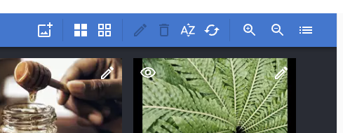
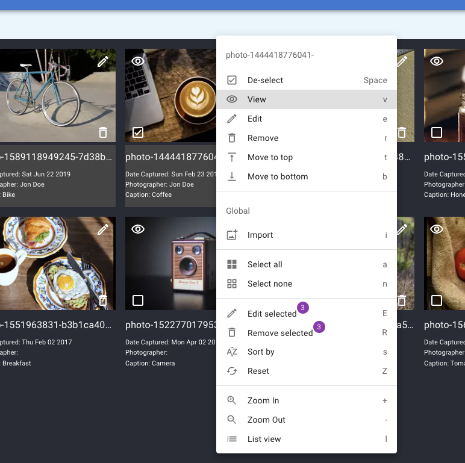

# Features

## Toolbar

You can perform the following actions from the toolbar:

-   (TODO-icon here) import new media items
-   (TODO-icon here) select all media item
-   (TODO-icon here) de-select all media item
-   (TODO-icon here) remove selected media items
-   (TODO-icon here) sort collection (by date mofified, author, caption)
-   (TODO-icon here) reset collection
-   (TODO-icon here) switch betwen grid and list view

## Import media

WIP

## View media

You can quickly view an item full-width by clicking on its thumbnail in **grid**, **list**, **edit** or **import** view. You can also use the `v` keyboard shortcut when focusing on an item, or use the context menu when right clicking on an item. You can see all details using the information icon `i`.

## Edit media

You can edit an item details by clicking on the view icon in grid or list view. You can also use the `e` keyboard shortcut when focusing on an item, or use the context menu when right clicking on an item.

Date modified is read only and you can edit author and caption. Once saved, a notification will appear.

## Grid View

## List View

## Context Menu

Context menu with all possible action can be opened when right clicking on a specific media item, on the top left icon, or anywhere else on the interface, as well as using the `m` keyboard shortcut.

## Notifications

For some actions, notifications can appear on the top left corner of the interface:

-   removing multiple media items
-   importing new media items
-   resetting the collection

## Keyboard Shortcuts

For accessibility, the extension can also be used using the following shortcuts, as appearing on the context menu:

-   `v` - view currently focused item
-   `e` - edit currently focused item
-   `r` - remove currently focused item
-   `i` - open the import drawer
-   `a` - select all items
-   `n` - deselect all items
-   `R` - remove selected items
-   `s` - sort items
-   `Z` - reset collection
-   `l` - list view
-   `g` - grid view
-   `m` - open context menu

## Manual re-ordering

The interface offers drag-and-drop to manually re-order media items in the collection.

For accessibility, the interface also offers to use the keyboard to re-order items. You can follow these steps:

-   focus an item using the `tab` key
-   move focus using arrow keys
-   trigger drag-and-drop using the `return` key
-   move the item using the arrow keys
-   end drag-and-drop and position the item using the `return` key again

## Sorting by

You can automatically sort the collection by:

-   modified date ascending
-   modified date descending
-   author ascending
-   author descending
-   caption ascending
-   caption descending

After a collection has been sorted, you can manually re-order using drag-and-drop.
