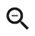
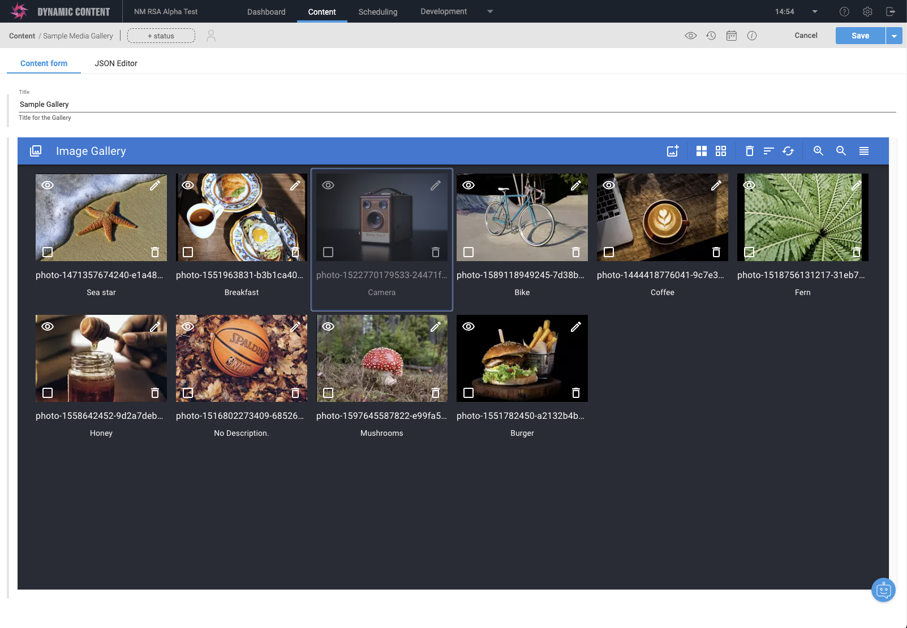

# Features

## Toolbar

You can perform the following actions from the toolbar:

| Icons | Actions |
|-------|---------|
|   | Import new media items. |
|   | Select and deselect all media items. |
|  | Remove selected media items. |
|  | Sort collection (by date mofified, name and any user specified metadata eg. author/caption). |
|  | Reset collection to its initial state. |
|   | Zoom in and zoom out in the grid view. |
|   | Switch between the list and grid views. |

> Note: The application logo on the left can be clicked to open the context menu.

## Import media

If you have previsouly imported media from a specific folder, and potentially a query, an alert bar provides information about:
- Available items: items in the folder not in your media collection yet.
- Updated items: items that have been updated in Content Hub.
- Out-of-sync items: items that you have manually updated locally in your collection.

When opening the import drawer, you can do the following actions:
- Navigate and choose a folder in Content Hub.
- Once a folder is selected, you can refine your selection using a query.
- You can see available, updated and out-of-sync items.
- You can select all, all updated, all out-of-sync items or deselect all.
- You can import your selection or cancel and close the drawer.

After import, a notification will display the number of items imported, and the import alert bar will be updated or closed if nothing can be imported from your last folder / query selection:

## View media

You can quickly view an item full-width by clicking on its thumbnail in **grid**, **list**, **edit** or **import** view. You can also use the `v` keyboard shortcut when focusing on an item, or use the context menu when right clicking it. You can see all details using the information icon `i`.

## Edit media

You can edit an item's details by clicking on the view icon in grid or list view. You can also use the `e` keyboard shortcut when focusing on an item, or use the context menu when right clicking on it.

Date Modified and Name are read only. You can view or edit additional metadata if specified in the extension configuration, for instance author and caption. Once saved, a notification will appear.

## Grid View

## List View

## Context Menu

A context menu with all possible actions can be opened when right clicking on a specific media item, on the top left icon, or anywhere else on the interface, as well as using the `m` keyboard shortcut.

## Notifications

For some actions, notifications can appear on the top left corner of the interface:

- Removing multiple media items.
- Importing new media items.
- Resetting the collection.

## Keyboard Shortcuts

For accessibility, the extension can also be used using the following shortcuts, as appearing on the context menu:

Item-specific actions:

| Key | Action |
|-----|--------|
| `space` | select / de-select item |
| `v` | view currently focused item |
| `e` | edit currently focused item |
| `r` | remove currently focused item |
| `t` | move currently focused item to top |
| `b` | move currently focused item to bottom |

Global actions:

| Key | Action |
|-----|--------|
| `i` | open the import drawer |
| `a` | select all items |
| `n` | deselect all items |
| `R` | remove selected items |
| `s` | sort items |
| `Z` | reset collection |
| `+` | zoom in grid view (one level only) |
| `-` | zoom out grid view (one level only) |
| `l` | switch to list view |
| `g` | switch to grid view |
| `m` | open context menu |
| `right and left arrows` | move focus to next / previous item in grid and list views |

Drag-and-drop actions:

| Key | Action |
|-----|--------|
| `return` | start / end keyboard drag-and-drop |
| `arrows` | move dragged item (you might need to press `space` to scroll the view) |
| `escape` | cancel keyboard drag-and-drop |

## Manual re-ordering

The interface offers drag-and-drop to manually re-order media items in the collection.

For accessibility, the interface also offers to use the keyboard to re-order items. You can follow these steps:

- Focus an item using the `tab` key.
- Move focus using arrow keys.
- Trigger drag-and-drop using the `return` key.
- Move the item using the arrow keys.
- End drag-and-drop and position the item using the `return` key again.

## Sorting by

You can automatically sort the collection by:

- modified date ascending
- modified date descending
- name ascending
- name descending
- additional metadata ascending and descending

After a collection has been sorted, you can manually re-order using drag-and-drop. The order is saved to the content item. Any newly imported items will always appear at the end, so remember to re-sort the collection when importing, or manually position the new items.
