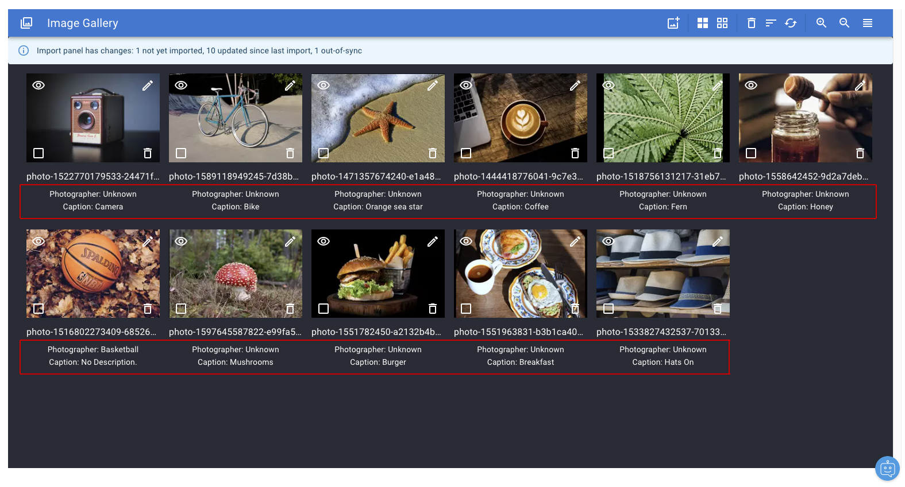
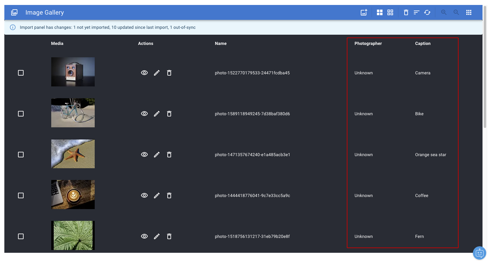
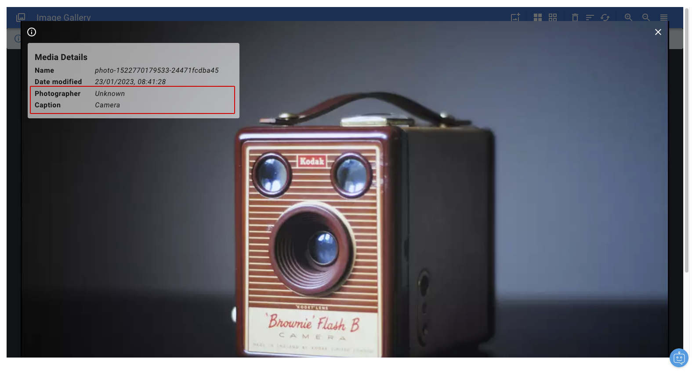
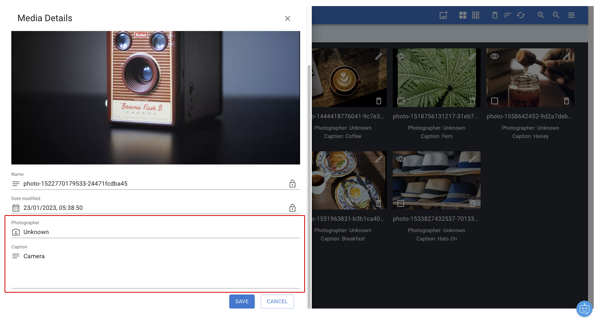
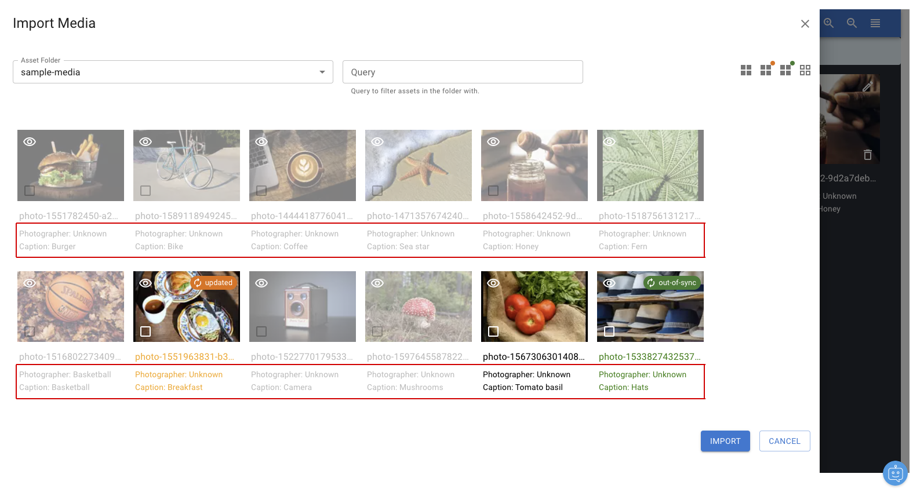
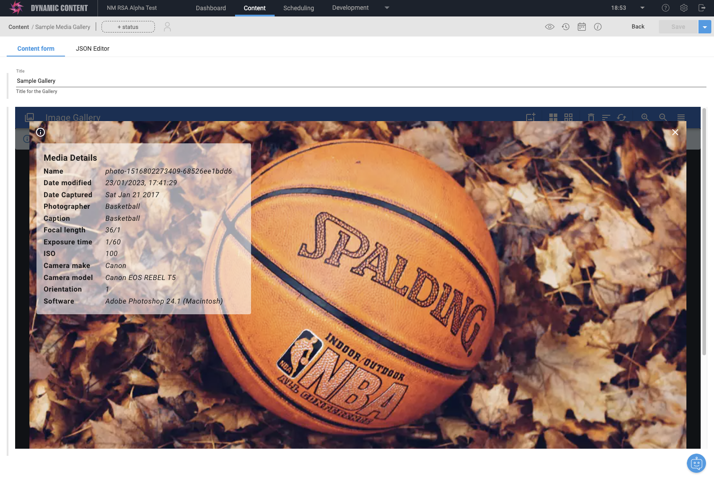

# Setting EXIF fields

You can control the metadata that is saved in the content, and displayed in the different views of the extension. This can be done by editing the extension's installation parameters. 

Here is a sample configuration with `photographer` and `caption` metadata, both sourced from `artist` and `description` in the EXIF metadata respectively:

```json
{
  "clientId": "xxxx",
  "clientSecret": "yyyy",
  "configPath": "galleryConfig",
  "galleryPath": "photoGallery",
  "metadataMap": [
    {
      "source": "exif/artist",
      "target": "photographer",
      "label": "Photographer",
      "editable": true,
      "sortable": true,
      "type": "string",
      "icon": "author",
      "visibility": [
        "edit",
        "import",
        "grid",
        "list",
        "info"
      ]
    },
    {
      "source": "exif/description",
      "target": "description",
      "label": "Caption",
      "editable": true,
      "sortable": true,
      "type": "multiline",
      "icon": "text",
      "visibility": [
        "edit",
        "import",
        "grid",
        "list",
        "info"
      ]
    }
  ]
}
```

Here is an example of EXIF metadata coming from Content Hub, showing other properties you can use:

```json
"values": {
    "orientation": 1.0,
    "exposureTime": "1\/400",
    "software": "Adobe Photoshop 24.1 (Macintosh)",
    "taken": 1.485992461E9,
    "description": "Breakfast",
    "isoSpeed": 100.0,
    "model": "Canon EOS REBEL T3i",
    "id": "cbf76dd4-db63-4edd-8f1a-ed18a9646729",
    "make": "Canon",
    "focalLength": "50\/1"
}
```

Metadata configuration properties:

| Property | Description |
|----------|-------------|
| `source` | Source field in the image metadata to copy to the content item. For now, the source can only be an EXIF field, prefixed with `exif/`. |
| `target` | The target field for the additional metadata. This needs to appear in your Media Gallery schema. |
| `label` | The label to use when displaying this metadata in the extension. |
| `type` | The type of editor used for this metadata. Can be `string`, `number`, `multiline` or `date`. (timestamp in milliseconds) |
| `editable` | Specifies if the field is read-only or editable in the details drawer. |
| `sortable` | Specifies if the field appears in the sort menu. |
| `icon` | An icon to display alongside the content editor. Options are `author` or `text`. |
| `visibility` | Controls the visibility of the field in the different views - `grid`, `list`, `info`, `edit`, `import`. (see below) |

Field visibility:

| Keyword | View |
|---------|------|
| `grid` | The field will appear in the grid view as additional lines. |
| `list` | The field will appear in the list view as additional columns. |
| `info` | The field will appear in the info panel in fullscreen view as additional rows. |
| `edit` | The field will appear in the edit drawer as additional read-only or editable fields. |
| `import` | The field will appear in the import grid view as additional lines. |

Additional metadata in `grid` view:



Additional metadata in `list` view:



Additional metadata in `info` view:



Additional metadata in `edit` view:



Additional metadata in `import` view:



## More detailed example

Installation parameters:

```json
{
  "clientId": "2f1f5720-8acc-43b5-9f67-bab73ba7524a",
  "clientSecret": "2a6d15b2a29459ddabfe6da0870e884a8ac2717966e67273d6425c88d319a7ef",
  "configPath": "galleryConfig",
  "galleryPath": "photoGallery",
  "metadataMap": [
    {
      "source": "exif/taken",
      "target": "taken",
      "label": "Date Captured",
      "editable": false,
      "sortable": true,
      "type": "date",
      "visibility": [
        "edit",
        "import",
        "grid",
        "list",
        "info"
      ]
    },
    {
      "source": "exif/artist",
      "target": "photographer",
      "label": "Photographer",
      "editable": true,
      "sortable": true,
      "type": "string",
      "icon": "author",
      "visibility": [
        "edit",
        "import",
        "grid",
        "list",
        "info"
      ]
    },
    {
      "source": "exif/description",
      "target": "description",
      "label": "Caption",
      "editable": true,
      "sortable": true,
      "type": "multiline",
      "icon": "text",
      "visibility": [
        "edit",
        "import",
        "grid",
        "list",
        "info"
      ]
    },
    {
      "source": "exif/focalLength",
      "target": "focalLength",
      "label": "Focal length",
      "editable": false,
      "sortable": false,
      "type": "string",
      "icon": "text",
      "visibility": [
        "info"
      ]
    },
    {
      "source": "exif/exposureTime",
      "target": "exposureTime",
      "label": "Exposure time",
      "editable": false,
      "sortable": false,
      "type": "string",
      "icon": "text",
      "visibility": [
        "info"
      ]
    },
    {
      "source": "exif/isoSpeed",
      "target": "isoSpeed",
      "label": "ISO",
      "editable": false,
      "sortable": false,
      "type": "string",
      "icon": "text",
      "visibility": [
        "info"
      ]
    },
    {
      "source": "exif/make",
      "target": "make",
      "label": "Camera make",
      "editable": false,
      "sortable": false,
      "type": "string",
      "icon": "text",
      "visibility": [
        "info"
      ]
    },
    {
      "source": "exif/model",
      "target": "model",
      "label": "Camera model",
      "editable": false,
      "sortable": false,
      "type": "string",
      "icon": "text",
      "visibility": [
        "info"
      ]
    },
    {
      "source": "exif/orientation",
      "target": "orientation",
      "label": "Orientation",
      "editable": false,
      "sortable": false,
      "type": "string",
      "icon": "text",
      "visibility": [
        "info"
      ]
    },
    {
      "source": "exif/software",
      "target": "software",
      "label": "Software",
      "editable": false,
      "sortable": false,
      "type": "string",
      "icon": "text",
      "visibility": [
        "info"
      ]
    }
  ]
}
```

Result in info panel:


